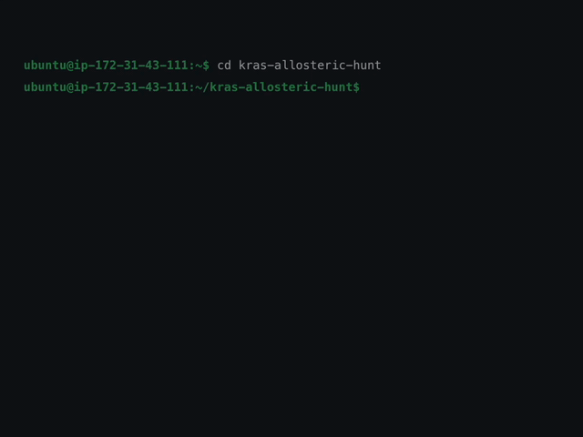
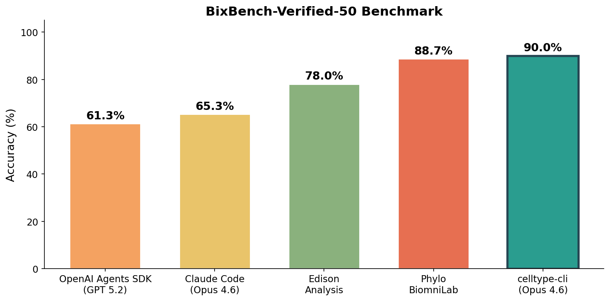

# celltype-cli

An autonomous agent for drug discovery research. Like Claude Code, but for biology.

Ask questions in natural language. celltype-cli plans the analysis, selects the right tools, executes them, validates results, and returns data-backed conclusions.



## Benchmark

CellType CLI achieves **90% accuracy** on [BixBench-Verified-50](https://huggingface.co/datasets/phylobio/BixBench-Verified-50), outperforming all existing agentic systems for computational biology.



| System | Accuracy |
|--------|----------|
| **celltype-cli (Opus 4.6)** | **90.0%** |
| Phylo BiomniLab | 88.7% |
| Edison Analysis | 78.0% |
| Claude Code (Opus 4.6) | 65.3% |
| OpenAI Agents SDK (GPT 5.2) | 61.3% |

## Why ct?

- **190+ drug discovery tools** — Target prioritization, compound profiling, dose-response modeling, pathway enrichment, safety assessment, clinical development, and more.
- **Claude-powered reasoning** — Built on the Claude Agent SDK. Claude plans multi-step research workflows, calls tools, self-corrects, and synthesizes findings.
- **Managed data pipelines** — One-command download of DepMap, PRISM, L1000, and proteomics datasets with auto-discovery loaders.
- **30+ database APIs** — PubMed, ChEMBL, UniProt, Open Targets, ClinicalTrials.gov, Reactome, PDBe, and more — no setup required.
- **Research UX** — Interactive terminal with @mentions, session resume, trace logging, HTML reports, and notebook export.
- **Persistent sandbox** — Stateful Python and R execution across turns (pandas, scipy, gseapy, pydeseq2, BioPython).
- **Open source** — MIT licensed.

## Installation

### Quick install

```bash
curl -fsSL https://raw.githubusercontent.com/celltype/cli/main/install.sh | bash
```

Detects Python 3.10+, installs via `pipx` or `pip`, and launches an interactive setup wizard.

### Manual install

```bash
# With pipx (isolated environment, recommended)
pipx install celltype-cli

# Or with pip
pip install celltype-cli

# Or with optional scientific stacks (RDKit, scanpy, torch, etc.)
pip install "celltype-cli[all]"

# Run the setup wizard
ct setup
```

### Authentication

```bash
# Interactive setup (recommended)
ct setup

# Or set directly
export ANTHROPIC_API_KEY="sk-ant-..."

# Non-interactive (CI/scripting)
ct setup --api-key sk-ant-api03-...
```

## Getting Started

### Basic usage

```bash
# Start interactive session
ct

# Single query
ct "What are the top degradation targets for this compound?"

# Validate setup
ct doctor
```

### Interactive commands

Inside `ct` interactive mode:

- `/help` — command reference + examples
- `/tools` — list all tools with status
- `/agents N <query>` — run N parallel research agents
- `/case-study <id>` — curated multi-agent case studies
- `/sessions`, `/resume` — session lifecycle
- `/copy`, `/export` — save/share outputs
- `/usage` — token and cost tracking

### Quick examples

**Target prioritization**
```
$ ct "I have a CRBN molecular glue. Proteomics shows it degrades
      IKZF1, GSPT1, and CK1α. Which target should I prioritize?"
```

**Combination strategy**
```
$ ct "My lead compound is immune-cold. What combination strategy should I use?"
```

**Resistance biomarkers**
```
$ ct "Build a resistance biomarker panel for my lead compound"
```

## Key Features

### 190+ Domain Tools

| Category | Examples |
|----------|---------|
| **Target** | Neosubstrate scoring, degron prediction, co-essentiality networks |
| **Chemistry** | SAR analysis, fingerprint similarity, scaffold clustering |
| **Expression** | L1000 signatures, pathway enrichment, TF activity, immune scoring |
| **Viability** | Dose-response modeling, PRISM screening, therapeutic windows |
| **Biomarker** | Mutation sensitivity, resistance profiling, dependency validation |
| **Clinical** | Indication mapping, population sizing, TCGA stratification |
| **Safety** | Anti-target flagging, multi-modal profiling, SALL4 risk |
| **Literature** | PubMed, OpenAlex, ChEMBL search |
| **DNA** | ORF finding, codon optimization, primer design, Golden Gate/Gibson assembly |
| **Data APIs** | MyGene, UniProt, Reactome, PDBe, ClinicalTrials.gov, and 25+ more |

### Data Management

```bash
# Download core datasets
ct data pull depmap        # DepMap CRISPR, mutations, expression
ct data pull prism         # PRISM cell viability
ct data pull msigdb        # Gene sets
ct data pull alphafold     # Protein structures (on-demand)

# Or point to existing data
ct config set data.depmap /path/to/depmap/
ct config set data.prism /path/to/prism/
```

Without local data, ct still works using 30+ database APIs.

### Reports

Every query auto-saves a markdown report. Convert to branded, self-contained HTML:

```bash
ct report list              # list reports
ct report publish           # convert latest .md to .html
ct report show              # open in browser
```

Dark theme, responsive layout, inline CSS. No CDN, no JavaScript. Shareable via email/Slack.

## Known Limitations

- **Local data for some tools** — Target, viability, expression, combination, biomarker tools need local DepMap/PRISM/L1000 datasets. The planner auto-excludes unavailable tools and uses API alternatives.
- **Optional dependencies** — RDKit (chemistry), scanpy (single-cell), torch (protein embeddings). Tools report install instructions if missing.
- **API rate limits** — PubMed, UniProt, Open Targets may rate-limit heavy usage.

## Troubleshooting

| Symptom | Fix |
|---------|-----|
| `ct` fails at startup | `ct doctor` |
| No API key | `ct setup` or `export ANTHROPIC_API_KEY=...` |
| Data not found | `ct data pull <dataset>` |
| Missing dependency | `pip install "celltype-cli[all]"` |
| Session lost | `ct --continue` (sessions auto-save) |

## Contributing

```bash
git clone https://github.com/celltype/cli.git
cd cli
pip install -e ".[dev]"
ct setup
pytest tests/
```

We welcome contributions — bug reports, feature requests, documentation improvements, and pull requests.

## Enterprise & On-Premise

celltype-cli is free and open source, powered by Claude out of the box.

For pharma and biotech teams that need to keep data on-premise, CellType offers proprietary research agent models purpose-built to replace frontier LLMs — deployable locally behind your firewall with zero data leaving your infrastructure.

**[Contact us](mailto:hello@celltype.com)** to learn more.

## License

MIT — see [LICENSE](LICENSE)

---

Built by [CellType Inc.](https://celltype.com)
